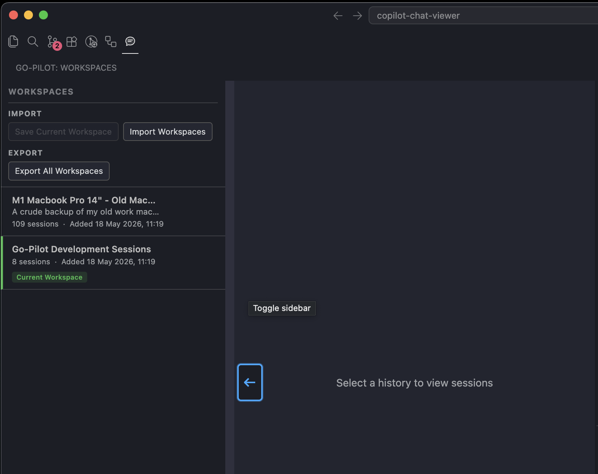
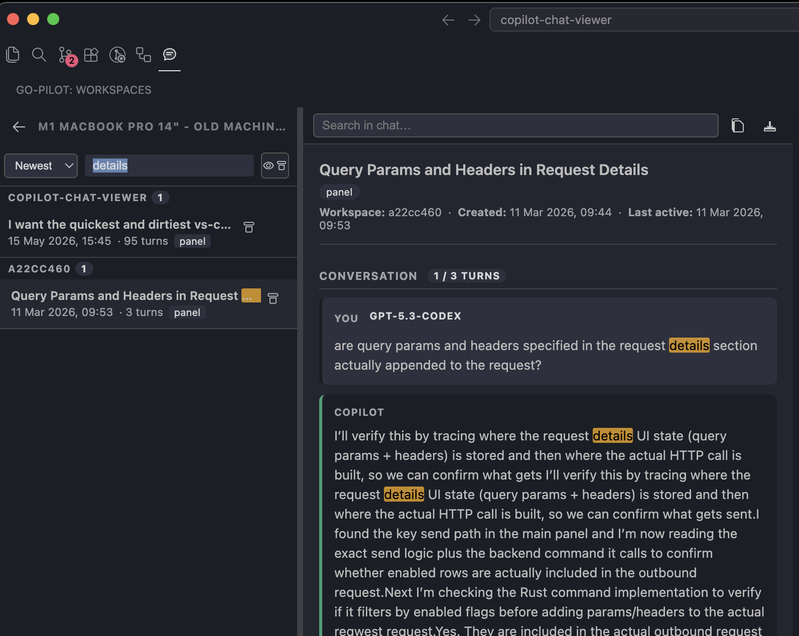

# Go-Pilot

A VS Code extension to browse, search, and back up your GitHub Copilot chat sessions.

<table>
  <tr>
    <td width="50%">
      
    </td>
    <td width="50%">
      
    </td>
  </tr>
</table>

---

## Platform Compatibility

| Platform | Status      | Notes                                                                                  |
| -------- | ----------- | -------------------------------------------------------------------------------------- |
| macOS    | ✅ Supported | Tested. Requires `sqlite3` (pre-installed on macOS or via `brew install sqlite3`).     |
| Windows  | ⚠️ Untested  | May work if `sqlite3.exe` is in PATH. The dev `install-extension` script is bash-only. |
| Linux    | ⚠️ Untested  | Should work if `sqlite3` is installed. Dev script requires `nvm`/bash.                 |

---

## Features

- **Browse sessions** — all your Copilot chat sessions across every workspace, sorted by date
- **Search** — filter sessions by title, workspace, or turn content
- **Read turns** — click any session to read the full Q&A transcript
- **Backup** — snapshot the current workspace's sessions into the extension's storage with one click
- **Manage histories** — rename, refresh, or remove backed-up histories

---

## Installing from a Release

1. Go to the [Releases](https://github.com/asos-dominicjomaa/co-copilot-pops/releases) page and download the `.vsix` file from the latest release.
2. In VS Code, open the Command Palette (`⇧⌘P` / `Ctrl+Shift+P`) and run:
   ```
   Extensions: Install from VSIX…
   ```
3. Select the downloaded `.vsix` file.
4. Reload VS Code when prompted.

The **Go-Pilot** icon will appear in the Activity Bar.

---

## Usage

| Action                   | How                                                   |
| ------------------------ | ----------------------------------------------------- |
| Open the viewer          | Click the chat icon in the Activity Bar               |
| Add a history folder     | Click **+** in the sidebar header                     |
| Backup current workspace | Click the cloud icon in the sidebar header            |
| Search sessions          | Type in the search box at the top of the session list |
| View a chat              | Click any session in the list                         |

---

## Copilot Slash Commands

This repo includes a reusable Copilot slash command:

- **`/version-and-commit`**: reviews local changes, decides **patch vs minor** bump (never major unless explicitly requested), updates `package.json` version + `changelog.md` (2-3 concise bullets), commits, and reports version/changelog/commit back in chat.  
  It **does not add co-author trailers**.
  It **does not push**.

---

## Development

```bash
# Install dependencies
npm install

# Run tests
npm test

# Package locally (requires Node 20)
npm run package
```

### Releasing

Releases are created via the **Release** GitHub Actions workflow (`Actions → Release → Run workflow`). It reads the version from `package.json`, runs tests, packages the `.vsix`, and publishes a GitHub release with the asset attached.

To bump the version before releasing:
```bash
npm version patch   # or minor / major
git push --follow-tags
```
Then trigger the Release workflow manually.
